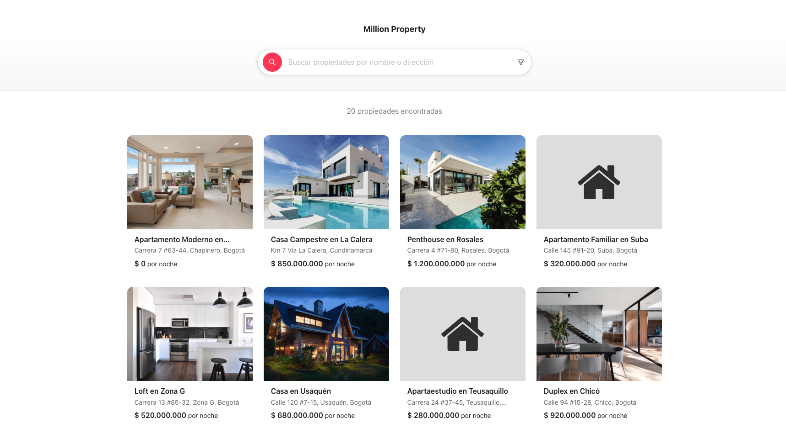

# Million Property App

Aplicación moderna de búsqueda y visualización de propiedades inmobiliarias construida con React, TypeScript, GraphQL y Ant Design.



## 🚀 Inicio Rápido

### Requisitos Previos

- Node.js v20.19.5 (recomendado usar `nvm` con el archivo `.nvmrc` incluido)
- Backend GraphQL corriendo en `http://localhost:5189/graphql`

### Instalación y Ejecución

```bash
# Instalar dependencias
npm install

# Iniciar servidor de desarrollo
npm run dev
```

La aplicación estará disponible en `http://localhost:5173`

### Variables de Entorno (Opcional)

El proyecto funciona sin archivos `.env` ya que tiene valores por defecto. Si deseas personalizarlos, crea un archivo `.env` con:

```env
# URL del API GraphQL (default: http://localhost:5189/graphql)
VITE_GRAPHQL_API_URL=http://localhost:5189/graphql
```

## 🏗️ Arquitectura del Proyecto

El proyecto sigue una **arquitectura basada en features** (feature-based architecture):

```
app/
├── components/                # Componentes compartidos (Atomic Design)
│   ├── atoms/                # Componentes básicos (Button, Input, Typography, Card)
│   ├── molecules/            # Combinación de atoms (si el proyecto lo requiere)
│   └── organisms/            # Componentes complejos (Header)
├── features/
│   └── property/              # Feature de propiedades
│       ├── components/        # Componentes específicos del feature
│       │   ├── PropertyCard/
│       │   ├── PropertyList/
│       │   └── PropertySearchBar/
│       ├── hooks/             # Hooks personalizados del feature
│       ├── services/          # GraphQL queries/mutations y hooks
│       │   ├── queries.ts     # Definición de queries GraphQL
│       │   ├── useQueries.ts  # Custom hooks useQuery
│       │   └── types.ts       # TypeScript types
│       └── types/             # Types específicos del feature
├── pages/                     # Páginas de la aplicación
│   ├── Home/
│   └── PropertyDetail/
├── shared/                    # Recursos compartidos
│   ├── apollo/               # Apollo Client config
│   ├── config/               # Configuraciones globales (env, theme)
│   ├── constants/            # Constantes globales
│   └── utils/                # Utilidades (formatters, etc.)
├── styles/                    # Estilos globales
└── main.tsx                  # Punto de entrada
```

### Atomic Design en Componentes Compartidos

La carpeta `components/` utiliza la metodología **Atomic Design** para centralizar componentes reutilizables:

- **Atoms** (`atoms/`): Componentes básicos e indivisibles (Button, Input, Typography, Card)
- **Molecules** (`molecules/`): Combinación de atoms para crear componentes más complejos (si el proyecto lo requiere)
- **Organisms** (`organisms/`): Componentes complejos que forman secciones completas (Header)

**Objetivo**: Centralizar todos los componentes del System Design en un solo lugar, facilitando cambios globales de diseño. Si se decide cambiar de librería UI (ej: Ant Design → Material UI), solo se modifican estos componentes compartidos sin afectar las features.

### Características Principales

- **GraphQL con Apollo Client**: Gestión de estado y datos mediante GraphQL
- **Feature-based Architecture**: Organización modular por características de negocio
- **Atomic Design**: Componentes del System Design centralizados para facilitar cambios (atoms, molecules, organisms)
- **TypeScript**: Tipado fuerte en toda la aplicación
- **Ant Design**: UI moderna y accesible
- **Sass/SCSS**: Preprocesador CSS para estilos avanzados
- **Vitest + Testing Library**: Suite de testing completa

## 🧪 Testing

El proyecto incluye tests unitarios con **Vitest** y **React Testing Library**.

### Ejecutar Tests

```bash
# Ejecutar todos los tests
npm test

# Modo watch (desarrollo)
npm run test:watch

# Con interfaz UI
npm run test:ui

# Generar reporte de cobertura
npm run test:coverage
```

### Cobertura de Tests por Componente

#### **PropertyCard** (12 tests)
- Renderizado correcto con datos
- Formato de precio
- Imágenes con fallback
- Navegación al hacer click
- Estados hover y cursor pointer

#### **PropertyList** (8 tests)
- Loading state
- Empty state
- Renderizado de múltiples propiedades
- Grid responsive
- Aplicación de className personalizada

#### **PropertySearchBar** (10 tests)
- Input de búsqueda funcional
- Debounce en búsqueda
- Popover de filtros de precio
- Slider de rango de precios
- Estados hover y focus

#### **Home** (14 tests)
- Renderizado inicial completo
- Funcionalidad de búsqueda por nombre/dirección (con debounce)
- Filtros por rango de precio (popover con slider)
- Paginación
- Navegación a detalle de propiedades
- Grid responsive de propiedades
- Conteo de propiedades encontradas

## 📦 Scripts Disponibles

```bash
npm run dev          # Servidor de desarrollo
npm run build        # Build de producción
npm run preview      # Preview del build
npm test             # Ejecutar tests
npm run test:watch   # Tests en modo watch
npm run test:ui      # UI de Vitest
npm run test:coverage # Reporte de cobertura
```

## 🛠️ Stack Tecnológico

- **React 19** - UI Library
- **TypeScript** - Lenguaje
- **Vite** - Build tool y dev server
- **Apollo Client** - Cliente GraphQL
- **Ant Design** - UI Framework
- **React Router** - Enrutamiento
- **Sass** - CSS Preprocessor
- **Vitest** - Testing framework
- **React Testing Library** - Testing utilities

## 🎨 Funcionalidades

- ✅ Búsqueda de propiedades por nombre o dirección (con debounce)
- ✅ Filtrado por rango de precio (slider interactivo)
- ✅ Paginación server-side
- ✅ Vista detallada de propiedades con galería de imágenes
- ✅ Diseño responsive (mobile-first)
- ✅ Imágenes con fallback automático
- ✅ Formato de precios en USD
- ✅ Navegación fluida entre vistas

---

Desarrollado con ❤️ usando React, TypeScript y GraphQL
